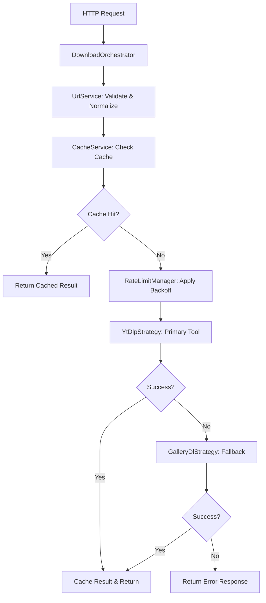

# 🎉 Instagram Downloader - Clean Architecture Implementation Complete

## ✅ **What We Built**

Successfully transformed the Instagram downloader from a monolithic application to a **clean, SOLID architecture** with comprehensive testing and Docker optimization.

### **🏗️ Architecture Patterns**
- **Strategy Pattern**: Pluggable download tools (yt-dlp + gallery-dl)
- **Facade Pattern**: Simplified interface via DownloadOrchestrator  
- **Dependency Injection**: Testable, maintainable services
- **Single Responsibility**: Each service has one clear purpose
- **Dependency Injection**: Services receive dependencies via constructor
- **Observer Pattern**: Structured logging and metrics collection

## 📁 **Project Structure**

```
src/
├── interfaces/
│   └── DownloadStrategy.js      # Strategy interface contract
├── strategies/
│   ├── YtDlpStrategy.js         # yt-dlp implementation
│   └── GalleryDlStrategy.js     # gallery-dl fallback
├── services/
│   ├── UrlService.js            # URL validation & normalization
│   ├── CacheService.js          # Redis caching operations
│   ├── RateLimitManager.js      # Smart backoff & stampede prevention
│   └── DownloadOrchestrator.js  # Main coordination service
test/
└── architecture.test.js         # Unit tests for architecture
server.js                        # Express app entry point
```

## 🔄 **Download Flow**



## 🎯 **SOLID Principles Implementation**

### **Single Responsibility Principle (SRP)**
- `UrlService`: Only handles URL operations
- `CacheService`: Only manages caching
- `RateLimitManager`: Only handles rate limiting
- `YtDlpStrategy`: Only executes yt-dlp
- `GalleryDlStrategy`: Only executes gallery-dl

### **Open/Closed Principle (OCP)**
- New download tools can be added by implementing `DownloadStrategy`
- No modification of existing code required for new strategies

### **Liskov Substitution Principle (LSP)**
- All strategies implement the same `DownloadStrategy` interface
- Any strategy can be substituted without breaking functionality

### **Interface Segregation Principle (ISP)**
- `DownloadStrategy` interface is focused and minimal
- Services don't depend on methods they don't use

### **Dependency Inversion Principle (DIP)**
- High-level modules depend on abstractions, not concretions
- Orchestrator depends on strategy interface, not specific implementations

## 🔧 **Key Components**

### **DownloadStrategy Interface**
```javascript
class DownloadStrategy {
    async execute(url, options) // Main execution method
    getName()                   // Strategy identifier
    getPriority()              // Execution priority (1 = highest)
    canHandle(url)             // URL compatibility check
    getEstimatedDuration()     // Performance hint
}
```

### **YtDlpStrategy (Primary)**
- **Priority**: 1 (highest)
- **Strategies**: 4 fallback approaches
  1. Fresh browser cookies (Chrome)
  2. File cookies with enhanced headers
  3. Firefox browser cookies
  4. Embed-only extraction
- **Features**: User-agent rotation, format selection, error categorization

### **GalleryDlStrategy (Fallback)**
- **Priority**: 2 (secondary)
- **Strategies**: 3 approaches
  1. Direct URL extraction
  2. JSON metadata parsing
  3. Simple download mode
- **Features**: Video URL detection, JSON parsing, minimal dependencies

### **Rate Limiting Features**
- **Smart Backoff**: Exponential backoff with jitter
- **Domain Tracking**: Per-domain failure tracking
- **Stampede Prevention**: Prevents duplicate requests for same URL
- **Success Recovery**: Automatic backoff reset on success

## 📊 **Monitoring & Observability**

### **Metrics Collected**
- Total requests & cache hit rate
- Success/failure rates per strategy
- Average response times
- Rate limit statistics
- Active request tracking

### **Structured Logging**
- Strategy execution details
- Error categorization
- Performance timings
- Cache operations
- Rate limit events

### **Health Endpoints**
- `GET /`: Basic health check
- `GET /status`: Comprehensive metrics and system status

## 🧪 **Testing**

### **Run Tests**
```bash
# Architecture tests
npm run test

# Specific test file
npm run test-architecture

# Download functionality test
npm run test-download
```

### **Test Coverage**
- URL validation and normalization
- Strategy configuration validation
- Rate limiting behavior
- Cache service interface
- Error handling patterns

## 🚀 **Usage Examples**

### **Basic Download**
```bash
curl -X POST -H "Content-Type: application/json" \
  -d '{"reelURL":"https://www.instagram.com/p/ABC123/"}' \
  http://localhost:3000/download
```

### **Check Service Health**
```bash
curl http://localhost:3000/status
```

### **Response Format**
```json
{
  "success": true,
  "downloadUrl": "https://...",
  "cached": false,
  "originalUrl": "https://www.instagram.com/p/ABC123/",
  "metadata": {
    "tool": "yt-dlp",
    "strategy": "fresh_browser_cookies",
    "duration": 2500,
    "responseTime": 2651,
    "cacheKey": "post_ABC123",
    "extractedAt": "2025-08-25T02:40:00.000Z"
  }
}
```

## 🔧 **Configuration Options**

### **Environment Variables**
```env
PORT=3000
REDIS_URL=redis://localhost:6379
COOKIES_PATH=./cookies/instagram.com_cookies.txt
NODE_ENV=production
```

### **Rate Limiting Configuration**
```javascript
// In RateLimitManager constructor
maxConsecutiveFailures: 3     // Max failures before backoff
baseBackoffMs: 1000          // Base backoff time
maxBackoffMs: 30000          // Maximum backoff time
```

### **Cache Configuration**
```javascript
// In CacheService constructor
defaultTtl: 20 * 24 * 60 * 60  // 20 days cache TTL
```

## 🔄 **Adding New Download Tools**

1. **Create Strategy Class**
```javascript
import { DownloadStrategy } from '../interfaces/DownloadStrategy.js';

export class NewToolStrategy extends DownloadStrategy {
    getName() { return 'new-tool'; }
    getPriority() { return 3; }
    canHandle(url) { return url.includes('instagram.com'); }
    
    async execute(url, options) {
        // Implementation here
        return {
            success: true,
            downloadUrl: 'extracted-url',
            tool: 'new-tool',
            strategy: 'strategy-name',
            duration: 1000,
            metadata: {}
        };
    }
}
```

2. **Register in Orchestrator**
```javascript
// In DownloadOrchestrator constructor
this.strategies = [
    new YtDlpStrategy(cookiesPath),
    new GalleryDlStrategy(cookiesPath),
    new NewToolStrategy(cookiesPath)  // Add here
].sort((a, b) => a.getPriority() - b.getPriority());
```

## 🐛 **Error Handling**

### **Error Categories**
- `invalid_url`: Malformed Instagram URL
- `rate_limit`: Instagram rate limiting
- `authentication`: Login required or private content
- `not_found`: Content deleted or unavailable
- `timeout`: Request timeout
- `unknown`: Unclassified errors

### **Fallback Behavior**
1. Primary tool (yt-dlp) attempts all strategies
2. If all yt-dlp strategies fail, try gallery-dl
3. If all tools fail, return categorized error
4. Rate limiting applies exponential backoff
5. Successful requests reset rate limit counters

## 📈 **Performance Considerations**

- **Caching**: 20-day Redis cache reduces external API calls
- **Stampede Prevention**: Prevents duplicate requests for same URL
- **Strategy Prioritization**: Fastest/most reliable methods first
- **Timeout Management**: Prevents hanging requests
- **Resource Limits**: Docker container limits prevent resource exhaustion

## 🔒 **Security Features**

- Input validation on all URLs
- Error message sanitization
- Rate limiting prevents abuse
- No direct file system access from user input
- Structured logging prevents log injection
